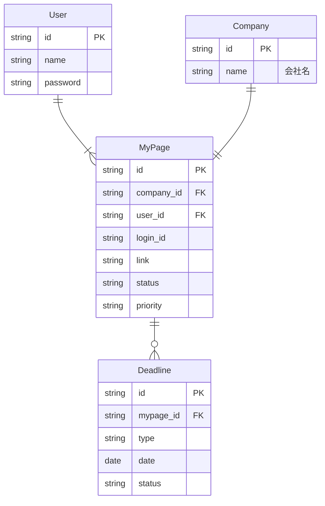

# 就活管理アプリ

このアプリは、**Laravel** と **React** を使用して開発された練習用アプリケーションです。就職活動を管理・整理するためのツールです。

## 機能

- 求人応募とそのステータスの管理
- 面接スケジュールやメモの追跡
- 企業情報や連絡先の保存

## 使用技術

- **バックエンド**: Laravel
- **フロントエンド**: React
- **データベース**: MySQL (MAMPを使用)

## セットアップ手順

1. リポジトリをクローンします:
    ```bash
    git clone <repository-url>
    ```
2. プロジェクトディレクトリに移動します:
    ```bash
    cd job_hunting_management
    ```
3. バックエンドの依存関係をインストールします:
    ```bash
    composer install
    ```
4. フロントエンドの依存関係をインストールします:
    ```bash
    npm install
    ```
5. `.env` ファイルを設定し、データベースやその他の設定を行います。
6. マイグレーションを実行してデータベースをセットアップします:
    ```bash
    php artisan migrate
    ```
7. 開発サーバーを起動します:
    ```bash
    php artisan serve
    ```
8. Reactの開発サーバーを起動します:
    ```bash
    npm run dev
    ```

## ER

